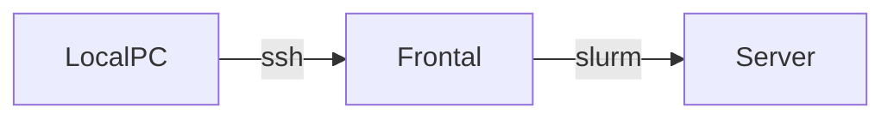

# User documentation

## How to connect to the server

Every user that can be authenticated with the multiforest-LDAP at IRCAD will be able to login to the server.    
Login can only be done via ssh with the following command:
```
ssh <user>@slurm.ircad.fr
```

Login on the frontal server is authorized as long as you are in the IRCAD multi-forest LDAP. If you encounter difficulties accessing the machine, please contact the administrators. Accessing the GPU server is however restricted, please ask the IRCAD R&D team about details on how to access it (the procedure is simple).

## General information

Accessing the GPU server cannot be done directly via ssh. Due to the shared nature of the resource, it requires the use of an intermediate job scheduler, that will deploy your code on the server.    
It implements a waiting queue in which you can submit jobs waiting to be launched on the server.    
The job scheduler used on the GPU server is [Slurm](https://slurm.schedmd.com/), please refer to the [quickstart guide](https://slurm.schedmd.com/quickstart.html) for more information.

### Hardware configuration

#### Global architecture

For the time being, the architecture is as follows:


Your local computer will connect to the server, called frontal, via ssh. From this server you will be able to allocate and dispatch a job on the Server via slurm commands.

#### Frontal node

This is the access point to the GPU server. It is a lightweight server that will allow you to prepare your scripts for execution on the server. It does not have any GPU.    

On this server, your home directory is stored on a NFS network storage shared with the GPU server.

#### GPU server

The hardware/OS configuration is as follows:
- NVIDIA DGX Station A100
- [AMD 7742](https://www.amd.com/fr/products/cpu/amd-epyc-7742) - 64 cores, with SMT enabled,
- 4 x { [NVIDIA A100 40 GB GPUs](https://www.nvidia.com/fr-fr/data-center/a100/) },
- `/scratch`: 7 To of fast temporary storage (NVMe disks), not backed-up.
- `/home`: NFS network storage, shared with the frontal node, not backed-up.

_Notes_:
- The `/scratch` directory is made up of fast NVMe disk. It is only meant for storing job data: input data copied from the network storage, temporary results, output data ... 
Please make sure to clean up the temporary data that might remain after your jobs ended. It is expected to be automatically and periodically cleaned up.
- The slurm configuration is built to optimize affinity between GPU and the closest CPU cores, but the results might differ according to the potential allocations already running on the server.

## Job scheduling

As previously said, Slurm is the job scheduler used on this machine and it is the only way to access the server.    
Ssh to the server is prevented, unless you have a job running on it.


### Environment configuration

We provide a configuration script that must be sourced to access all the resources of the GPU servers. All those resources are present on both the frontal node and the GPU server. This script must be sourced in your current shell to access slurm and additional pre-installed resources, like anaconda, using the following command:
```
source /opt/server-env.sh
```

Please keep in mind that it must also be sourced, when submitting a job.

<!--
This script also gives you access to the `module` command. This command allows to configure your environment to make new software available to your shell. Here are the most important commands:
- `module avail`: lists all the pre-installed software on the server
- `module list`: lists all the pieces of software currently loaded in your current environment
- `module load <module>`: loads the software named <module> in your current environment
- `module unload <module>`: unloads the software named <module> from your current environment

If you require custom installations of software, please ask the IRCAD/IHU R&D team.

Currently available modules:
- anaconda/2019.07
- cuda/10.0
- cuda/10.1
- singularity/3.4.0 
-->

Furthermore, you must make sure to use at least CUDA 11 in your environments. The A100 are very recent and only compatible with CUDA 11 and up, according to the [compatibility matrix](https://docs.nvidia.com/deeplearning/cudnn/support-matrix/index.html).

### Slurm
Here are a few important slurm commands:
- `srun`: run the command in argument on the server
- `sbatch`: allows to submit a batch script for execution is slurm queue
- `squeue`: allows to query the current job queue for the server
- `sinfo`: allows to get information about the available partitions (different queues a job can go in ...)
- `scancel`: allows you to cancel a job. You will only be able to cancel your jobs.

We also provide small wrapper functions (via the sourced `/opt/server-env.sh` script):
- `sinteractive`: allows you to quickly get an interactive job, if resources are available. This command is notably useful to prepare a batch script. The options are the same as the ones for the `srun` command.
- Command aliases are also available for the `sinfo` (aliased as `si`) and the `squeue` (aliased as `sq`) commands. They allow to display more information than their counterpart, e.g. the `sq` alias will display the number of resources allocated (CPUs, GPUs, ...) per queued jobs.

By default, no GPUs will be allocated to your jobs. To allocate GPUs, please use:
- Either the `--gpus=N`, when N is the desired number of GPUs, additionally you can specify the number of CPU cores to use per GPU with the `--cpus-per-gpu` option;
- Or the `--grep=gpu:N`, when N is the desired number of GPUs, additionally you can increase the number of cpu cores used with the `--ntasks` option.

Additionally, the current default execution time is 1 hour and the maximum execution time is 1 day.    
You can modify the default execution time with the `--time` option. Please ensure that your job will fit in amount of time you reserve it for, otherwise it might end up being killed prematurely.

Please refer to the [Slurm quickstart guide](https://slurm.schedmd.com/quickstart.html) for additional information about the available commands.

#### Examples

##### srun

The [srun](https://slurm.schedmd.com/srun.html) command allows you to quickly run a job on the GPU server.

Allocate a job with 4 GPUs and run the nvidia-smi command:
```
srun --gpus=4 nvidia-smi
```

Provided that you have already created the `tf-2.0` environment, this command will allocate a 1 GPU job and do the following:
- Configure the environment (load anaconda into the environment),
- Activate the `tf-2.0` conda environement,
- Print the current tensorflow version.

```
srun --gpus=1 \
    bash -c \
       "source /opt/server-env.sh ; 
        conda activate tf-2.0 ;
        python -c \"import tensorflow as tf ; print(tf.__version__)\""
```

As you can see, commands can easily get long when you start executing more complex scripts, it is therefore advise to use `srun` only for short commands and use `sbatch` for more complex codes.

##### sbatch

[sbatch](https://slurm.schedmd.com/sbatch.html) is a slurm command that will allow you to submit a script containing all the commands to be run for your application. This script also accepts header arguments to configure the allocation.

Example given using the command from the previous section:
```
#!/bin/bash
#SBATCH -p public
#SBATCH --gpus=4
#SBATCH --chdir=/mnt/volatilraid/userrd/

source /opt/server-env.sh 
conda activate tf-2.0
python -c "import tensorflow as tf ; print(tf.__version__)"
```

### Optimizing slurm jobs

CPU affinity of GPUs has been configured on the server. This means that when allocating a job you can tell slurm to use the CPU closest to the allocated GPUs, this will tend to improve performance, because the "distance" from the CPU to the GPU will be shorter.    
To only allocate CPU cores closest to the GPUs, please use the `--gres-flags=enforce-binding` option. This might however delay the allocation of your job, if someone else reserved those CPU cores for their jobs.

On the contrary, you can use `--gres-flags=disable-binding`, which will allocate any available CPU for your job. This will minimize your waiting time in the queue, but might reduce the overall performance of your code.

### Data management

As there are several levels/layers of disk management on the server, you must avoid writing/reading intermediate results on your home directory.  Writing directly to the /scratch partition will ensure the best performance for your algorithm.

Data should thus be handled according to the following scenario:
- Copy your data from your local computer to your home directory (`/home/<username>`) on the server, via rsync/scp or any compatible GUI interface,
- Submit a job allocation via slurm, then within the allocation (for example in the batch script):
  - Copy your data from your home directory (`/home/<username>`) to your scratch directory, located at `/scratch/<username>`,
  - Launch your application and write the results in a subdirectory of `/scratch/<username>`,
  - Move back your results from `/scratch/<username>` to your home directory and delete your input data from the `/scratch` partition.
- Finally, copy back your results from your home directory to your local computer. Once they are copied, please also make sure that you delete them from your home directory on the frontal node/server.

<!--
### Quota

A usage quota has been put in place. Each person has an associated account (that you can see as a group of users).   
Those accounts allow to group users by team and apply usage quota on the server.    

The quota is currently managed on a per-month basis and reinitialized each 1st day.     
Each group gets an amount of CPU and GPU hours that corresponds to the full use of the resources for half of the month.
-->

### Software

#### Remote development

Remote editing of content can be done via traditional console tools like nano, vim or emacs.     
If you don't feel comfortable using those tools, we advise you to use [Visual Studio Code](https://code.visualstudio.com/). 
This piece of software will allow you to perform remote editing of content on the frontal node via SSH. 
In order to properly configure VS Code for remote editing via SSH, please refer to the following link: https://code.visualstudio.com/docs/remote/ssh.

#### Port redirection from the frontal node (via SSH port tunneling)

If you need to access a network port on the frontal node (e.g. to use tensorboard or jupyter notebooks), this can be done via ssh tunneling.    
If you plan to launch a service (e.g. web server) using port 6007 on slurm.ircad.fr, you just have to initiate a connection via the following command:
```
ssh  -L8007:slurm.ircad.fr:8008 slurm.ircad.fr
```
And then launch the application that will use this port.    
The 8008 port on the remote machine (slurm.ircad.fr) will then be redirected to the 8007 port on your local host,   
thus making the service accessible via the address: localhost:8007 (e.g. for a web service: http://localhost:8007). Accessing will directly forward you to the webserver located on the remote machine.

#### Port redirection from the deep-learning server (via SSH port tunneling)

Redirecting a port from the Deep-Learning server to your local machine is also possible via ssh.    
It will require 2 ssh connections to perform the tunnel from the server to the frontal node and then from the frontal node to your machine.    

First make sure that you can access the frontal node from the server via ssh:
```shell
$ source /opt/server-env.sh
# Launch a shell job on the server
$ srun --pty bash
# Copy you ssh key from the server to the frontal node
# IMPORTANT: This will only work if you generated a key without passphrase
$ ssh-copy-id slurm.ircad.fr
```
This must only be done once (as long as you don't overwrite your ssh keys).

Then initiate a port redirection from the frontal node to your local machine, via an ssh connection:
```shell
# Redirect port 8891 of the frontal node to your local host
ssh -L 8891:localhost:8891 slurm.ircad.fr
```

When submitting a job, include the following command in you sbatch script, before calling the command that requires the opening of a port:
```
# Redirect port 8891 from the Deep-Learning server to port 8891 on the frontal node
# This command will be launched in the background, and thus will be non-blocking
ssh -N -f -R 8891:localhost:8891 slurm.ircad.fr
```
This will create a reverse ssh port redirection, effectively redirecting port 8891 from the server to the frontal node.    
This double port forwarding should allow you to make a port of the server accessible to your local host.

#### Git

You can normally access `git.ircad.fr`-hosted code repositories, both via ssh and https.

#### Docker

Docker is not available on the GPU server, because of security issues (notably privilege escalation). We strongly recommend using anaconda or pip as an alternative, if using python.

In other cases, you can use [Singularity](https://singularity.lbl.gov/docs-docker). It is an alternative to docker that can pull images from docker hub and the docker format. It is more secure as it ensure that the user does not have root access inside the container (See: https://sylabs.io/guides/3.4/user-guide/security.html).

Please refer to the [official documentation](https://sylabs.io/guides/3.4/user-guide/singularity_and_docker.html) for usage with docker.

Examples of usage:
- Pull tensorflow image (in read-only mode) and launch python inside it. The `--nv` option allows the container to access the graphic cards:
```shell
singularity pull docker://tensorflow/tensorflow:latest-gpu-py3
singularity exec --nv tensorflow_latest-gpu-py3.sif python3
```

- Pull a docker image from a private registry as a sandbox (which will allow modifications to the images, then launch it in writable mode:
```shell
singularity build --docker-login docker://registry.domain.com/project/app:stable
singularity exec --nv app_stable.sif python3 /home/application/process.py -i video_in.mp4 -o video_output.mp4
```

Notes: 
- When submitting a job, the number of available devices will automatically be restricted according to your reservation.
- When executing an application from an image, there are a few things to remember:
  - The image will be in read-only mode
  - You will be the same user as on the host os. So if modifications requires root access, you must modify the image on a computer where you have root access and singularity installed.
  - Several directories will be automatically mounted in the image filesystem: `/home/$USER`, `/tmp`, and `$PWD`

#### Software
If you require any other piece of software to be made available on the server, please send a mail to the administrators.